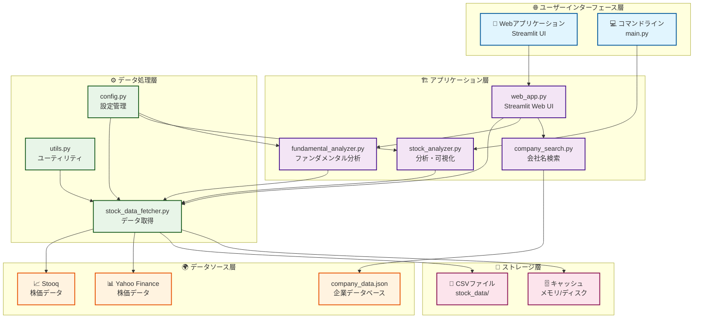
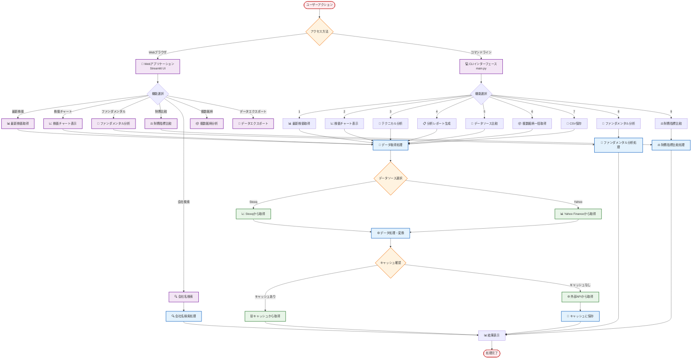
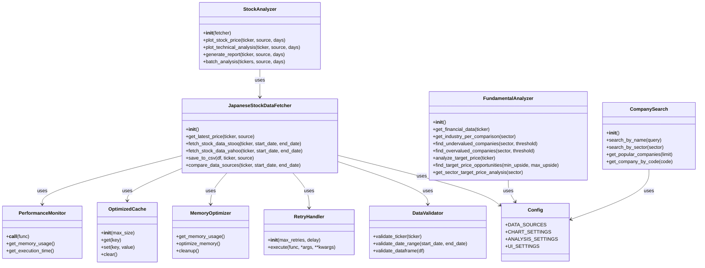
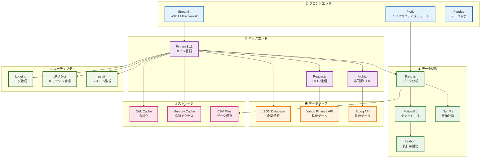

# 🇯🇵 日本の株価データ取得・分析システム - システム構成図

## 📊 システム全体構成図

## 🔄 データフロー図

## 🏗️ クラス構成図

## 🔧 技術スタック構成図

## 📝 図表の説明

### 1. システム全体構成図
- **4層アーキテクチャ**: ユーザーインターフェース、アプリケーション、データ処理、データソース
- **コンポーネント間の関係**: 依存関係とデータフローを明確化
- **色分け**: 各層を異なる色で分類

### 2. データフロー図
- **ユーザーアクションから結果まで**: 完全な処理フロー
- **分岐処理**: 機能選択とデータソース選択
- **キャッシュ処理**: パフォーマンス最適化の仕組み

### 3. クラス構成図
- **主要クラス**: システムの核となるクラス群
- **依存関係**: クラス間の使用関係
- **メソッド**: 主要な機能メソッド

### 4. 技術スタック構成図
- **使用技術**: Python、Streamlit、Pandas等
- **役割分担**: 各技術の担当領域
- **依存関係**: 技術間の連携

これらの図表により、システムの全体像、データの流れ、技術的な実装詳細を視覚的に理解できます。 